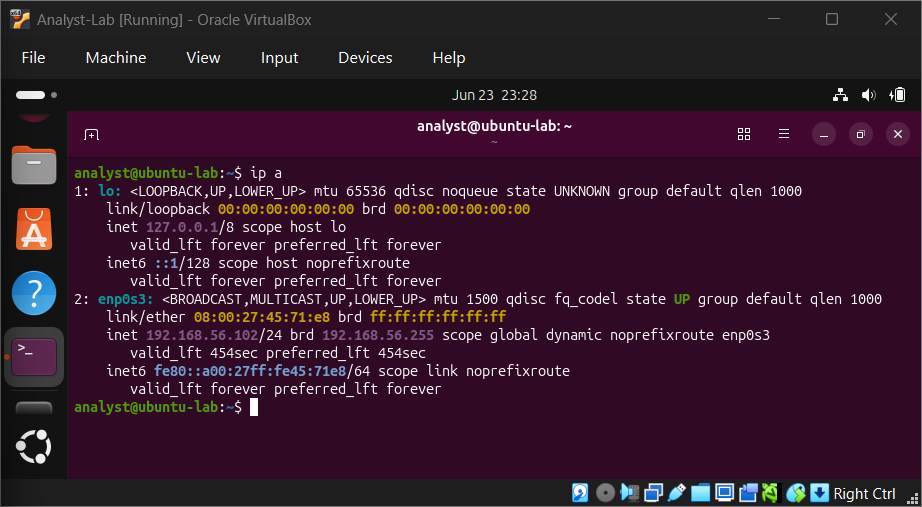
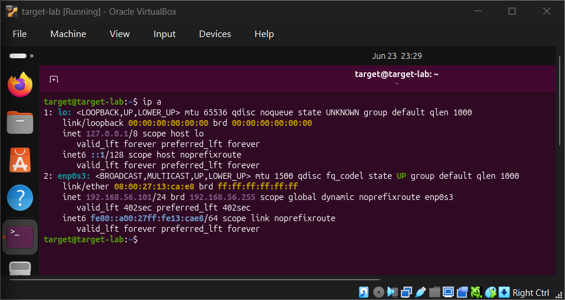
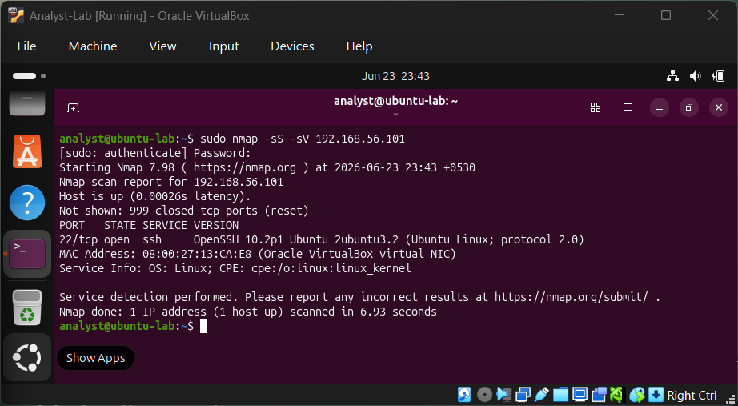
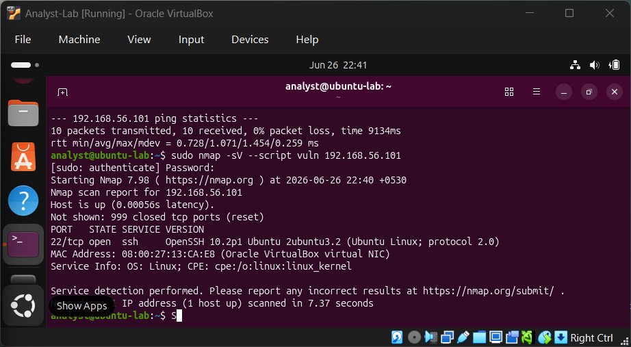

# SOC Lab: Network Reconnaissance & Service Enumeration

## Overview

This project simulates a real-world SOC (Security Operations Center) workflow using a controlled virtual lab environment.

It demonstrates how a security analyst identifies active hosts, discovers exposed services, and evaluates potential security risks using standard tools like Nmap.

---

## Lab Objective

To build a practical cybersecurity environment and perform:

- Internal network discovery
- Service enumeration
- Security analysis of exposed services
- Documentation of findings in SOC format

---

## Lab Architecture

### Analyst VM
- Role: Security Analyst Workstation
- IP Address: 192.168.56.102
- Tools: Nmap

### Target VM
- Role: Simulated Server Asset
- OS: Ubuntu Server
- IP Address: 192.168.56.101

### Network
- Type: Host-only Adapter
- Purpose: Isolated internal lab communication

---

## Project Workflow

1. Created VirtualBox lab environment  
2. Configured Host-only networking  
3. Installed Ubuntu Server on target VM  
4. Enabled SSH service on target machine  
5. Performed internal network reconnaissance  
6. Identified active services using Nmap  
7. Documented findings and analysis  

---

## Key Finding

### SSH Service Exposure

Port:
22/tcp

Service:
SSH (Secure Shell)

Risk Level:
Medium

---

### Evidence

Analyst VM IP configuration:

Target VM IP configuration:

Nmap scan confirming SSH exposure:

---

### Interpretation

The target system exposes an SSH service, allowing remote administrative access.

In real-world environments, this requires strict security controls such as:
- Strong authentication mechanisms
- Monitoring of login attempts
- Restricting unauthorized access
- Regular patching and updates

---

## Tools Used

- VirtualBox
- Ubuntu Linux
- Ubuntu Server
- Nmap
- SSH

---

## Skills Demonstrated

- Virtual lab setup
- Network configuration (Host-only networking)
- Service enumeration
- Security analysis
- SOC-style documentation
- Basic risk assessment

---

## Real-World Relevance

SSH is one of the most commonly exposed services in enterprise environments.

SOC analysts continuously monitor SSH activity to detect:
- Unauthorized access attempts
- Brute-force attacks
- Misconfigured systems
- Internal asset exposure

This project simulates the reconnaissance phase used in real security operations.

---

## Vulnerability Assessment

A vulnerability scan was performed against the target Ubuntu Server using Nmap.

### Finding

SSH service exposure detected.

### Details

Port:
22/tcp

Service:
SSH

Version:
OpenSSH 10.2p1 Ubuntu

### Risk

SSH provides remote administrative access. If not properly secured, it can become a target for unauthorized access attempts.

### Recommendation

- Use strong authentication methods
- Monitor SSH login attempts
- Restrict unnecessary access

### Evidence

## Conclusion

This lab demonstrates the foundational workflow of a SOC analyst: identifying assets, discovering exposed services, and evaluating security risks in a controlled environment.

It serves as a base for more advanced projects involving:
- Vulnerability scanning
- Log analysis
- SIEM integration
- Attack simulation
